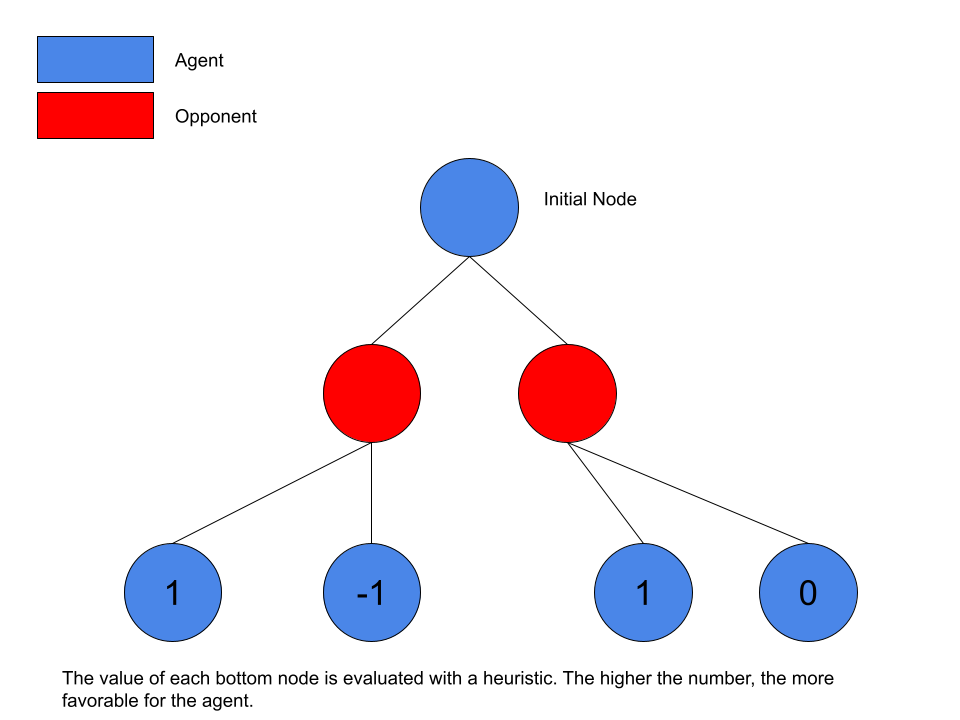

# Connect 4 AI

## Table of Contents:
### Setup
- Installation
- Running the Program

### File Structure / Explanation
- The Board (board.py)
- The Game (game1p.py)
- The Agent (agent.py)

## Setup
### Installation
First, download this git repository. You can do that through the Github website interface, or through the command:
> git clone https://github.com/daniel-chuang/connect4-ai

After you do that, open your terminal and change the active directory to the repository you just downloaded.
> cd _<PATH/TO/DIRECTORY>_

Once you have done that, make sure that you have Python https://www.python.org/downloads/ installed on your computer. There are many guides online to download Python, so I won't describe that here.

Afterwards, run the command below in order to install all of the packages used in this repository.
>pip install -r requirements.txt

### Running the Program
Once you have everything set up, just type the following command in your terminal (make sure your active directory is still the one from before)
>python game1p.py

## File Structure / Explanation
### The Board
The Connect4 board is represented as a Python class.

>__Description__
>The class for the Connect4 board. Takes an input of WIDTH, HEIGHT, and BLOCKSIZE. However, these are all set to default values
if not specified.
>
>__Attributes:__
>- board.player
>- board.in_a_row
>- board.WIDTH
>- board.HEIGHT
>- board.BLOCKSIZE
>- board.matrix
>
>__Methods:__
>- board.move(position)
>- board.movesMade()
>- board.terminal()

### The Game
>__Description__
>Connect 4 replica made with Pygame
>
>__Details__
>2 Players: 1 Human, 1 AI (code in agent.py)
>7 by 6 board. Win by connecting four pieces in a row.
>
>__Instructions__
>The player controls the placement of pieces using the number keys 1 through 7, which each number corresponding to the column in the game the piece will be placed in. 

### The Agent

The agent is a minimax algorithm, which is an adversarial tree search. The algorithm determines the best move at a certain point by identifying all possible boardstates after one move, two moves, etc, until a specific search depth is reached. 

The best algorithm would search to all possible end states. However, due to the size of the amount of possibilities, that is computationally impossible for standard devices. According to [The Online Encyclopedia of Integer Sequences](https://oeis.org/A212693), there are 4531985219092 total possible Connect4 board states, so obviously searching through the entire tree is unpragmatic.

Once the specified depth is reached, each node at the bottom is evaluated using a heuristic. Currently, this algorithm just evaluates if the node has a winner. The higher the value, the better the boardstate for the agent. The lower the value, the better the boardstate for the opponent.

The agent assumes that the opponent will play optimally and select the best moves for itself. As such, the nodes where the opponent is playing have a heuristic value equal to the lowest value from all of the bottom nodes.

The agent now chooses to decend down the node that will yield the highest heuristic value, which in the case of this image, is the node to the right.

With that, we have a functioning agent! Of course, this example was simplified, but that is the essence of how to make a Connect4 AI.